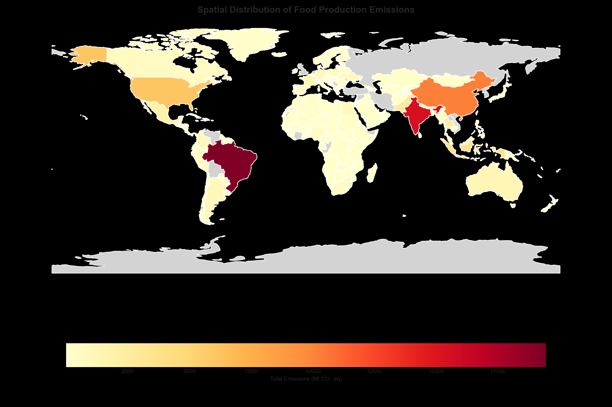
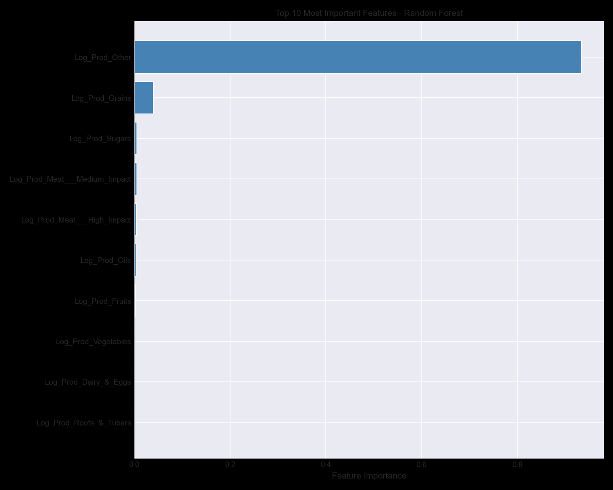

# Environmental Impact of Food Production
## A Spatial Data Science Analysis of Global Food Emissions

## Overview

This project analyzes global food production emissions using spatial data science and machine learning techniques.

By integrating FAOSTAT production data (1961–2022) with environmental footprint datasets, this study identifies geographic emission hotspots, product-level environmental impacts, and country-level emission patterns.

The final Random Forest regression model achieved:

- R² Score: 99.93%
- Mean Absolute Percentage Error (MAPE): 4.02%

The analysis reveals that nearly half of global food-production emissions originate from only five countries.

 

   

> **Predicting and mapping environmental impacts of global food production using spatial regression analysis**

## 📋 Executive Summary

This project integrates **FAOSTAT agricultural production data** (1961-2022, 200+ countries) with **product-level environmental footprints** to answer critical questions about food system emissions.

### Key Achievements

| Metric | Result |
|--------|--------|
| **Variance Explained** | 99.93% (R² = 0.9993) |
| **Prediction Accuracy** | 4.02% MAPE |
| **Data Coverage** | 14,045 country-years, 1961-2022 |
| **Top 5 Countries Share** | 47.7% of global emissions |

### 🎯 Key Finding

> **Food production emissions are hyper-concentrated in Asia and South America, driven by a small number of high-intensity products (coffee, chocolate, beef), with just 5 countries accounting for nearly half of global emissions.**

---

## 📊 Visual Highlights

| Top 10 Emitting Countries | Global Emissions Heatmap |
|:-------------------------:|:------------------------:|
|  |  |

| Emissions Trend (1961-2022) | Feature Importance |
|:---------------------------:|:------------------:|
|  |  |

---

## 🔍 Research Questions

1. **What** are the environmental impacts of food production?
2. **Where** are these emissions produced geographically?
3. **Can we predict** emissions from production patterns alone?
4. **Which countries and products** should be prioritized for mitigation?

---

## 📁 Repository Structure
