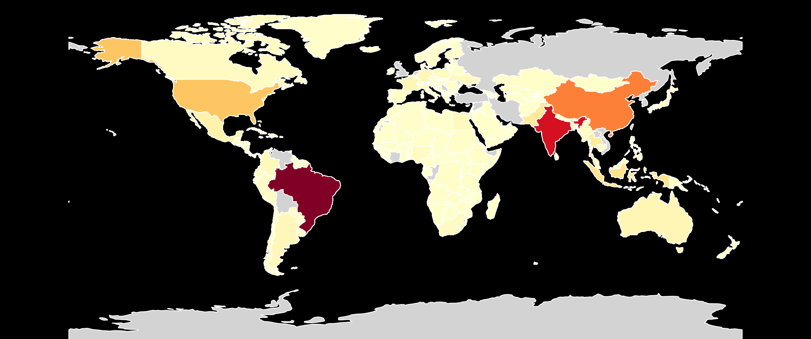

# Environmental Impact of Food Production
## A Spatial Data Science Analysis of Global Food Emissions




## Overview

This project analyzes global food production emissions using spatial data science and machine learning techniques.

By integrating FAOSTAT production data (1961–2022) with environmental footprint datasets, this study identifies geographic emission hotspots, product-level environmental impacts, and country-level emission patterns.

The final Random Forest regression model achieved:

- R² Score: 99.93%
- Mean Absolute Percentage Error (MAPE): 4.02%

The analysis reveals that nearly half of global food-production emissions originate from only five countries.

1. Brazil 19,440 16.4% ████████████████████████████████</br>
2. India 15,445 13.0% ██████████████████████████████</br>
3. China 10,219 8.6% ████████████████████</br>
4. United States 6,070 5.1% ███████████</br>
5. Indonesia 3,715 3.1% ██████</br>
6. Pakistan 2,784 2.3% █████</br>
7. Thailand 2,585 2.2% █████</br>
8. Mexico 1,768 1.5% ███</br>
9. Australia 1,319 1.1% ██</br>
10. France 1,269 1.1% ██</br>


## Research Questions

- What are the environmental impacts of food production?
- Which countries generate the highest food-production emissions?
- Can emissions be predicted from agricultural production patterns?
- Which products contribute most to global emissions?
- What spatial patterns exist across continents?


# Datasets

### FAOSTAT
- Global food production statistics
- Years: 1961–2022

### Environmental Footprint Dataset
Includes:
- Greenhouse gas emissions
- Water usage
- Land use
- Transport impacts

### Spatial Data
- Country geometries
- Continental boundaries
- Geographic coordinates


graph LR
    A[FAOSTAT Production] --> C[Data Integration]
    B[Environmental Footprints] --> C
    C --> D[14,045 Country-Year Records]
    D --> E[Spatial Regression Model]
    E --> F[Predictions + Spatial Insights]

    

</br>

## Tech Stack

- Python
- Pandas
- GeoPandas
- NumPy
- Scikit-learn
- Matplotlib
- Seaborn
- Plotly
- Folium
- Jupyter Notebook

</br>
## Project Workflow

1. Data Collection
2. Data Cleaning
3. Exploratory Data Analysis (EDA)
4. Spatial Feature Engineering
5. Geospatial Visualization
6. Machine Learning Modeling
7. Model Evaluation
8. Policy Insight Extraction

</br>
### Feature Engineering

Created 13 production categories from 48 original food products:

| Category | Products Included |
|----------|-------------------|
| Meat (High Impact) | Beef (beef herd), Beef (dairy herd), Lamb |
| Meat (Medium Impact) | Pig Meat, Poultry Meat |
| Other | Coffee, Dark Chocolate, Wine, Soy products |

### Model Specifications

```python
Model: RandomForestRegressor
Parameters:
  - n_estimators: 100
  - random_state: 42
  
Transformations:
  - Target: log1p (handles 8-order magnitude range)
  - Features: StandardScaler
  
Train/Test Split: 80/20 (11,236 / 2,809 rows)
```

</br>

## Repository Structure
```
food-emissions-spatial-analysis/
│
├── README.md                          # Main entry point (MOST IMPORTANT)
├── LICENSE                            # MIT or Apache 2.0
├── requirements.txt                   # Python dependencies
├── .gitignore                         # Exclude data files
│
├── data/                              # Data folder (add to .gitignore if large)
│   ├── raw/                           # Original CSV files
│   │   ├── Food_Production.csv
│   │   └── FAOSTAT_production.csv
│   └── processed/                     # Cleaned data
│       └── integrated_emissions.csv
│
├── notebooks/                         # Jupyter notebooks
│   ├── 01_data_integration.ipynb
│   ├── 02_exploratory_analysis.ipynb
│   ├── 03_spatial_analysis.ipynb
│   └── 04_regression_modeling.ipynb
│
├── scripts/                           # Python scripts
│   ├── data_preprocessing.py
│   ├── feature_engineering.py
│   ├── spatial_analysis.py
│   └── regression_model.py
│
├── outputs/                           # Generated files
│   ├── figures/
│   │   ├── spatial_emissions_map.png
│   │   ├── top_10_countries.png
│   │   ├── emissions_trend.png
│   │   ├── feature_importance.png
│   │   └── model_performance.png
│   ├── tables/
│   │   └── top_emitters.csv
│   └── reports/
│       └── SPATIAL_DATA_SCIENCE_PROJECT_REPORT.pdf
│
├── docs/                              # Documentation
│   ├── methodology.md
│   ├── data_dictionary.md
│   └── spatial_insights.md
│
└── interactive/                       # Optional: Interactive dashboard
    ├── app.py                         # Streamlit app
    └── requirements_dashboard.txt
```

## Installation

```bash
git clone https://github.com/yourusername/global-food-emissions-spatial-analysis.git

cd global-food-emissions-spatial-analysis

pip install -r requirements.txt
```


---

# 14. How to Run

```
Run notebooks in order:

1. Data Collection
2. Cleaning
3. EDA
4. Spatial Analysis
5. Modeling
```


</br>
---

## 📊 Key Results

### Model Performance

| Metric | Value | Interpretation |
|--------|-------|----------------|
| **R² (Test)** | 0.9993 | 99.93% variance explained |
| **RMSE** | 108.68 Mt CO₂eq | Absolute error |
| **MAPE** | **4.02%** | Average prediction error |
| **Regional Bias** | < 1% | Consistent across all continents |

### Top 5 Most Important Features

| Feature | Importance | Interpretation |
|---------|------------|----------------|
| Log_Prod_Other | **93.37%** | Coffee, chocolate, wine dominate |
| Prod_Seafood | 3.98% | Farmed fish and shrimp |
| Log_Prod_Meat_High_Impact | 0.59% | Beef and lamb |
| Log_Prod_Roots_&_Tubers | 0.58% | Potatoes, cassava |

### Top 10 Emitting Countries

| Rank | Country | Emissions (Mt CO₂eq) | Share |
|------|---------|---------------------|-------|
| 1 | **Brazil** | 19,440 | 16.4% |
| 2 | **India** | 15,445 | 13.0% |
| 3 | **China** | 10,219 | 8.6% |
| 4 | **United States** | 6,070 | 5.1% |
| 5 | **Indonesia** | 3,715 | 3.1% |

### Regional Breakdown

| Continent | Total Emissions | Mean per Country | Global Share |
|-----------|----------------|------------------|--------------|
| Asia | 39,349 Mt | 1,063 Mt | 43.1% |
| South America | 22,561 Mt | **2,256 Mt** | 24.7% |
| North America | 10,117 Mt | 632 Mt | 11.1% |

---


</br>

## 💡 Key Spatial Insights

### Insight 1: Extreme Geographic Concentration

```
Top 1 Country (Brazil):     ████████████████ 16.4%
Top 5 Countries:            ████████████████████████████████████████ 47.7%
Top 10 Countries:           ██████████████████████████████████████████████████████ 63.0%
Remaining 190+ Countries:   ████████████████████████████ 37.0%
```

### Insight 2: South America's Outlier Status

| Metric | South America | Global Average | Ratio |
|--------|---------------|----------------|-------|
| Mean emissions/country | 2,256 Mt | 1,117 Mt | **2.02x** |

### Insight 3: The "Other Products" Paradox

Despite low production volume, "Other" category (Coffee, Chocolate, Wine) shows **93.4% feature importance** due to:

- **Dark Chocolate:** 18.7 kg CO₂eq/kg (14.3 from land use change)
- **Coffee:** 16.5 kg CO₂eq/kg
- **Wine:** 1.4 kg CO₂eq/kg (64% from packaging + transport)

### Insight 4: Temporal Trend

- **Growth:** 3.6x increase (1961-2022)
- **Peak:** 2022 (still increasing, no plateau)
- **Policy implication:** Urgent intervention needed

---


## Future Improvements

- Add trade-flow data
- Add climate-zone spatial features
- Disaggregate "Other" product categories
- Add water scarcity modeling
- Add land-use change estimation


---
</br>

## 📧 Contact

**Author:** Dariush Mohmmadzadeh
- GitHub: [@yourusername](https://github.com/dariushmmz)


## ⭐ Star This Project

If you found this analysis useful, please consider starring the repository!
